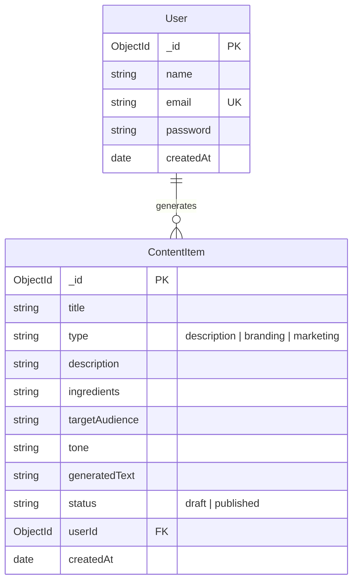

# FlavorForge AI

FlavorForge AI is an AI-powered web application designed to help food businesses generate professional product descriptions, branding content, and e-commerce-ready marketing copy using Google Gemini AI.

---

## 🚀 Features

* AI-generated product descriptions
* Multiple content tone options
* Product input dashboard
* Regenerate response functionality
* Copy-to-clipboard support
* Responsive modern UI

---

## 🛠️ Tech Stack

### Frontend

* Next.js
* Tailwind CSS

### Backend

* Node.js
* Express.js

### Database

* MongoDB Atlas

### AI Integration

* Google Gemini API

### Deployment

* Vercel
* Render

---

## 📦 Project Structure

frontend/
backend/

---

## 🗄️ Database Design & Architecture

We have integrated a cloud-hosted **MongoDB Atlas** database using the **Mongoose ODM**. 

### Rationale
MongoDB is a document-based NoSQL database, making it ideal for our flexible food branding datasets. Since generated marketing copies, descriptions, and profiles are schema-fluid text structures, a document model avoids heavy, unnecessary migrations and speeds up read/write latency.

### Data Model ER Diagram
Below is our database entity schema. The `User` entity has a one-to-many relationship with `ContentItem` (a user can generate many content profiles).



---

## ⚙️ Setup & Installation

### Backend Setup
1. Navigate to the backend directory:
   ```bash
   cd backend
   ```
2. Install dependencies:
   ```bash
   npm install
   ```
3. Create your `.env` configuration file:
   ```bash
   copy .env.example .env
   ```
4. Update the `MONGODB_URI` inside `.env` with your MongoDB Atlas connection string.
5. Boot the API server in development mode:
   ```bash
   npm run dev
   ```

### Frontend Setup
1. Navigate to the frontend directory:
   ```bash
   cd ../frontend
   ```
2. Install packages:
   ```bash
   npm install
   ```
3. Run the Next.js development server:
   ```bash
   npm run dev
   ```
4. Access the web app in your browser at `http://localhost:3000`.

---

## 📌 Project Goal

FlavorForge AI aims to help small and medium food processing businesses improve their digital product presentation through AI-powered content generation and branding assistance.

---

## 📄 License

MIT License
